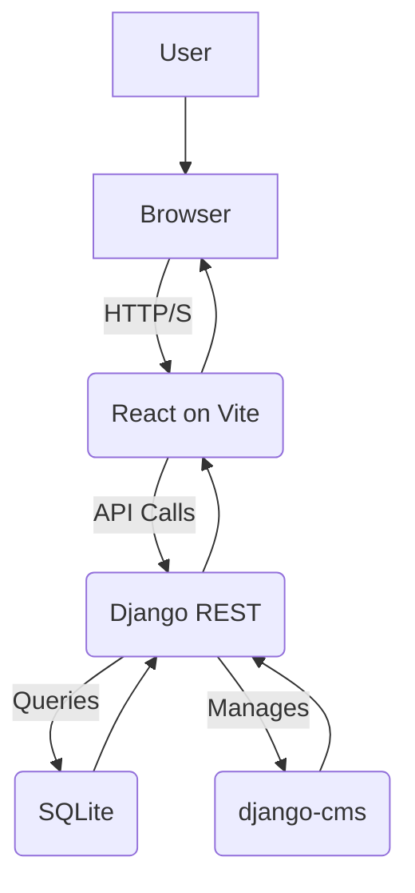

#  MISTRA djangoCMS

[](https://opensource.org/licenses/MIT)
[](https://reactjs.org/)
[](https://www.djangoproject.com/)
[](https://vitejs.dev/)

✏️ **A comprehensive, containerized web application featuring a Django CMS backend and a React frontend, designed for scalability and easy development.**

---

## 📜 Table of Contents

- [MISTRA djangoCMS](#mistra-djangocms)
  - [📜 Table of Contents](#-table-of-contents)
  - [📖 Introduction](#-introduction)
  - [🛠️ Tech Stack \& Architecture](#️-tech-stack--architecture)
    - [Frontend](#frontend)
    - [Backend](#backend)
    - [Architecture Diagram](#architecture-diagram)
  - [⚙️ Prerequisites \& Setup](#️-prerequisites--setup)
    - [Prerequisites](#prerequisites)
    - [Step-by-Step Instructions](#step-by-step-instructions)
  - [▶️ Running the Project](#️-running-the-project)
  - [🔄 Execution Flow](#-execution-flow)
  - [🚀 Usage \& Examples](#-usage--examples)
    - [Taking a Quiz](#taking-a-quiz)
    - [Administering Content](#administering-content)
  - [📋 API Reference](#-api-reference)
  - [⚖️ License](#️-license)

---

## 📖 Introduction

This project provides a robust foundation for building modern web applications. It combines the power of Django for backend content management and API services with the flexibility of React for a dynamic user experience. The entire environment is containerized with Docker, ensuring consistency across development, testing, and production environments.

---

## 🛠️ Tech Stack & Architecture

This project follows a decoupled client-server architecture.

### Frontend

*   **Framework:** [React](https://reactjs.org/)
*   **Build Tool:** [Vite](https://vitejs.dev/)
*   **Routing:** [React Router](https://reactrouter.com/)
*   **Key Libraries:**
    *   [jsPDF](https://github.com/parallax/jsPDF)
    *   [html2canvas](https://html2canvas.hertzen.com/)
    *   [DOMPurify](https://github.com/cure53/DOMPurify)

### Backend

*   **Language:** [Python](https://www.python.org/)
*   **Framework:** [Django](https://www.djangoproject.com/)
*   **API:** [Django REST Framework](https://www.django-rest-framework.org/)
*   **CMS:** [django-cms](https://www.django-cms.org/)
*   **CORS:** [django-cors-headers](https://github.com/adamchainz/django-cors-headers)
*   **Database:** SQLite (default, configurable)

### Architecture Diagram



---

## ⚙️ Prerequisites & Setup

### Prerequisites

*   [Docker](https://www.docker.com/get-started)
*   [Docker Compose](https://docs.docker.com/compose/install/)

### Step-by-Step Instructions

1.  **Clone the repository:**
    ```bash
    git clone https://github.com/TomZanna/mistra-djangocms.git
    cd mistra-djangocms
    ```

2.  **Build and run the containers:**
    ```bash
    docker compose up --build -d
    ```

---

## ▶️ Running the Project

Once the containers are running, the application is accessible at:

*   **Frontend:** `http://localhost:5173`
*   **Backend API:** `http://localhost:8000`
*   **Django Admin:** `http://localhost:8000/admin`

To manage the services, use the following commands:

*   **Start all services:** `docker compose up --build`
*   **Apply migrations:** `docker compose exec backend python manage.py migrate`
*   **Create a superuser:** `docker compose exec backend python manage.py createsuperuser`
*   **Initialize the database:** `docker compose run --rm web python manage.py loaddata appQuiz/initial_db/init.json`

---

## 🔄 Execution Flow

1.  **User Interaction:** A user accesses the website and interacts with the React frontend.
2.  **API Request:** The frontend makes API calls to the Django backend to fetch or submit data (e.g., quiz questions, answers).
3.  **Backend Processing:** Django receives the request, processes it, and interacts with the SQLite database.
4.  **API Response:** The backend sends a JSON response back to the frontend.
5.  **UI Update:** The frontend updates the UI dynamically based on the API response.

---

## 🚀 Usage & Examples

### Taking a Quiz

1.  Navigate to the quiz page.
2.  Answer the questions and submit the form.
3.  Receive a score and a downloadable PDF of your results.

### Administering Content

1.  Log in to the Django admin at `http://localhost:8000/admin`.
2.  Use the django-cms interface to manage pages, plugins, and content.

---

## 📋 API Reference

| Method | Endpoint            | Description                  |
| ------ | ------------------- | ---------------------------- |
| `GET`  | `/api/questions/`   | Retrieve all quiz questions. |
| `GET`  | `/api/tests/`       | Retrieve all tests.          |
| `GET`  | `/api/sex/`         | Retrieve all sexes.          |
| `POST` | `/api/submit-quiz/` | Submit quiz answers.         |

---

## ⚖️ License

This project is licensed under the MIT License. See the [LICENSE](LICENSE) file for details.
